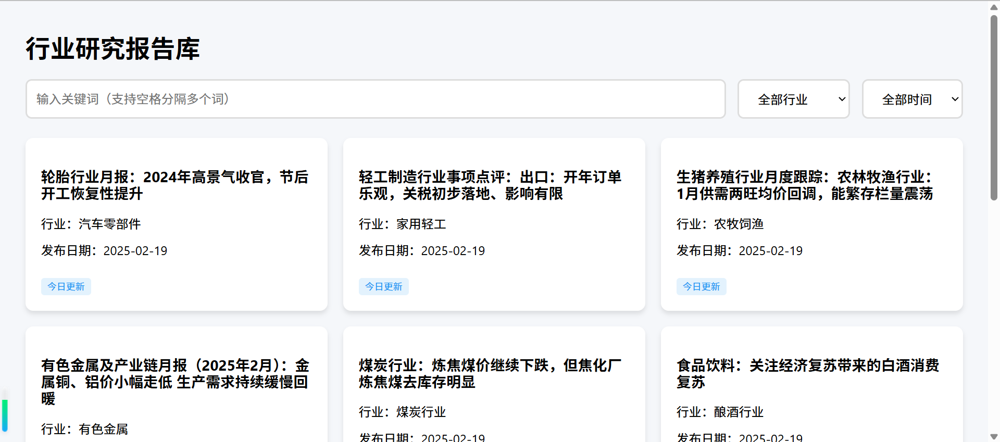

# 研究报告

> 每天定时 12:00 更新，数据从 2024-01-01 开始拉取，每天累计更新。

## 按时间查看

- [日报](eastmoney/today.md) — 当日最新研报汇总
- [周报](eastmoney/week.md) — 本周研报汇总
- [月报](eastmoney/month.md) — 本月研报汇总

## 按行业查看

<details>
<summary>展开全部行业（75个）</summary>

| 行业名称 | 行业名称 | 行业名称 | 行业名称 | 行业名称 |
| --- | --- | --- | --- | --- |
| [专业服务](eastmoney/专业服务.csv) | [专用设备](eastmoney/专用设备.csv) | [中药](eastmoney/中药.csv) | [互联网服务](eastmoney/互联网服务.csv) | [仪器仪表](eastmoney/仪器仪表.csv) |
| [保险](eastmoney/保险.csv) | [光伏设备](eastmoney/光伏设备.csv) | [光学光电子](eastmoney/光学光电子.csv) | [公用事业](eastmoney/公用事业.csv) | [农牧饲渔](eastmoney/农牧饲渔.csv) |
| [化学制品](eastmoney/化学制品.csv) | [化学制药](eastmoney/化学制药.csv) | [化学原料](eastmoney/化学原料.csv) | [化纤行业](eastmoney/化纤行业.csv) | [化肥行业](eastmoney/化肥行业.csv) |
| [医疗器械](eastmoney/医疗器械.csv) | [医疗服务](eastmoney/医疗服务.csv) | [医药商业](eastmoney/医药商业.csv) | [半导体](eastmoney/半导体.csv) | [商业百货](eastmoney/商业百货.csv) |
| [多元金融](eastmoney/多元金融.csv) | [家用轻工](eastmoney/家用轻工.csv) | [家电行业](eastmoney/家电行业.csv) | [小金属](eastmoney/小金属.csv) | [工程建设](eastmoney/工程建设.csv) |
| [工程机械](eastmoney/工程机械.csv) | [房地产开发](eastmoney/房地产开发.csv) | [房地产服务](eastmoney/房地产服务.csv) | [教育](eastmoney/教育.csv) | [文化传媒](eastmoney/文化传媒.csv) |
| [旅游酒店](eastmoney/旅游酒店.csv) | [有色金属](eastmoney/有色金属.csv) | [水泥建材](eastmoney/水泥建材.csv) | [汽车整车](eastmoney/汽车整车.csv) | [汽车零部件](eastmoney/汽车零部件.csv) |
| [消费电子](eastmoney/消费电子.csv) | [游戏](eastmoney/游戏.csv) | [煤炭行业](eastmoney/煤炭行业.csv) | [物流行业](eastmoney/物流行业.csv) | [环保行业](eastmoney/环保行业.csv) |
| [玻璃玻纤](eastmoney/玻璃玻纤.csv) | [珠宝首饰](eastmoney/珠宝首饰.csv) | [生物制品](eastmoney/生物制品.csv) | [电力行业](eastmoney/电力行业.csv) | [电子元件](eastmoney/电子元件.csv) |
| [电子化学品](eastmoney/电子化学品.csv) | [电池](eastmoney/电池.csv) | [电源设备](eastmoney/电源设备.csv) | [电网设备](eastmoney/电网设备.csv) | [石油行业](eastmoney/石油行业.csv) |
| [纺织服装](eastmoney/纺织服装.csv) | [美容护理](eastmoney/美容护理.csv) | [能源金属](eastmoney/能源金属.csv) | [航天航空](eastmoney/航天航空.csv) | [航空机场](eastmoney/航空机场.csv) |
| [航运港口](eastmoney/航运港口.csv) | [船舶制造](eastmoney/船舶制造.csv) | [装修建材](eastmoney/装修建材.csv) | [装修装饰](eastmoney/装修装饰.csv) | [计算机设备](eastmoney/计算机设备.csv) |
| [证券](eastmoney/证券.csv) | [贵金属](eastmoney/贵金属.csv) | [软件开发](eastmoney/软件开发.csv) | [通信服务](eastmoney/通信服务.csv) | [通信设备](eastmoney/通信设备.csv) |
| [通用设备](eastmoney/通用设备.csv) | [造纸印刷](eastmoney/造纸印刷.csv) | [酿酒行业](eastmoney/酿酒行业.csv) | [采掘行业](eastmoney/采掘行业.csv) | [钢铁行业](eastmoney/钢铁行业.csv) |
| [铁路公路](eastmoney/铁路公路.csv) | [银行](eastmoney/银行.csv) | [非金属材料](eastmoney/非金属材料.csv) | [风电设备](eastmoney/风电设备.csv) | [食品饮料](eastmoney/食品饮料.csv) |

</details>

## 研报搜索平台

[manymore13.github.io/report](https://manymore13.github.io/report/)

- 多关键词搜索研报
- 按行业筛选研报
- 按时间筛选研报



## agent工具

[report cli](https://github.com/manymore13/eastmoney) — 查询、分析和下载券商研报的命令行工具。支持行业研报、个股研报、策略报告、宏观研究、券商晨报。

在 AI Agent（Cursor、Claude Code、Cline、Codex 等）对话框中发送：

```
请帮我安装 skill: https://raw.githubusercontent.com/manymore13/report-cli/refs/heads/master/.claude/skills/report-cli/SKILL.md
```

安装后直接用自然语言交互：

- "帮我查一下游戏行业最近有什么研报"
- "半导体行业最近 5 篇，只看 10 页以上的"
- "贵州茅台最新研报说了什么？"
- "宁德时代最近有什么研报，只看买入评级的"
- "今天的券商晨报说了什么"
- "宏观研究最近有什么新观点"
- "最近有没有看好新能源车的策略报告"
- "光伏和风电行业对比一下"
- "有哪些行业可以查"
- "把这三篇下载到 ./reports 目录"

Agent 会自动区分：你说"查/看/了解"就走查询，说"下载"才下载。

---

## 公众号

**好生意笔记** — 每天拆解一门好生意的赚钱逻辑，商业故事 × 投资视角。

- 微信对话方式查询行业研报
- 关注后回复「研报」获取行业深度研报入口
- 底部菜单【查估值】查看指数低估机会


